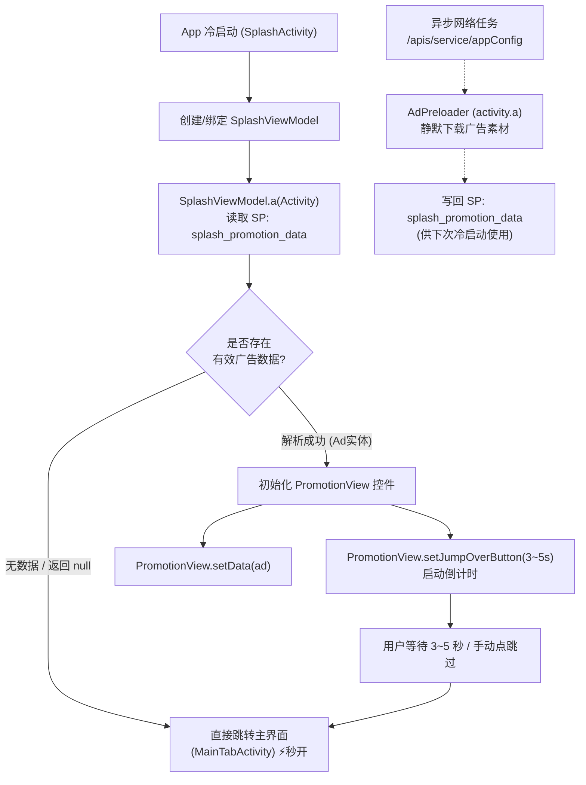

# 超星学习通开屏广告底层机制与秒跳全链路技术总结

> **文档属性**：核心技术沉淀与架构设计总结  
> **逆向证据**：基于超星学习通官方 classes13.dex 实机反编译与 Dalvik 字节码分析  
> **框架技术栈**：Android Xposed / YukiHookAPI / Kotlin  

---

## 一、 背景与逆向证据链

在 Android 应用中，开屏广告（Splash/Promotion Ads）通常是用户启动应用时体验阻碍最大的环节。学习通客户端经过多次架构演进，开屏广告已由早期的单体 Activity 模式演化为结合 **Jetpack MVVM 架构 + 本地 SharedPreferences 异步缓存 + 自定义 PromotionView 控件** 的多级呈现机制。

通过对 `classes13.dex` 等核心 Dex 的反汇编与类结构解析，我们锁定了广告全链路的关节点：



---

## 二、 学习通广告实现机制逐层拆解

### 1. 数据层：`SplashViewModel` 的本地拉取与反序列化
在 `com.chaoxing.mobile.activity.SplashViewModel` 中，开屏广告的获取逻辑高度聚合在形如 `a(Activity activity)` 的方法中。

#### 伪代码还原（学习通原逻辑）：
```java
public class SplashViewModel extends ViewModel {
    
    // a 方法：尝试从本地获取开屏广告模型
    public Ad a(Activity activity) {
        // 1. 读取本地偏好设置中的广告 JSON 字符串
        SharedPreferences sp = activity.getSharedPreferences(
            activity.getPackageName() + "_preferences", 
            Context.MODE_PRIVATE
        );
        String adJson = sp.getString("splash_promotion_data", null);
        if (TextUtils.isEmpty(adJson)) {
            adJson = sp.getString("_splash_promotion_data", null);
        }
        
        if (TextUtils.isEmpty(adJson)) {
            return null; // 无缓存广告byzensu357
        }

        try {
            // 2. 调用工具类 so0.a 反序列化 JSON 成为 Ad 实体
            Ad ad = so0.a(adJson, Ad.class);
            // 3. 校验时效性 (startTime ~ endTime)
            if (ad != null && ad.isValidTime()) {
                return ad;
            }
        } catch (Exception e) {
            // 解析失败
        }
        return null;
    }
}
```

### 2. 展现层：`PromotionView` 容器与倒计时
当 `SplashActivity` 获取到非空的 `Ad` 对象后，会动态加载开屏广告控件 `com.chaoxing.mobile.activity.PromotionView`。

#### 伪代码还原（学习通原逻辑）：
```java
public class PromotionView extends FrameLayout {
    private ViewPager vpPromotion;
    private ImageView ivSplash;
    private TextView btnJumpOver;

    // 绑定广告数据
    public void setData(Ad ad) {
        if (ad == null) {
            setVisibility(View.GONE);
            return;
        }
        // 渲染图片、配置跳转链接与曝光打点
        loadAdImage(ad.getImageUrl());
    }

    // 设置跳过按钮倒计时秒数
    public void setJumpOverButton(int seconds) {
        if (seconds <= 0) {
            triggerSkip(); // 立即结束倒计时并关闭广告
            return;
        }
        startCountDownTimer(seconds);
    }
}
```

### 3. 跳转层：独立推广页 `PromotionActivity`
除在 `SplashActivity` 内部嵌入控件外，部分活动推广还会直接拉起独立的 `com.chaoxing.mobile.activity.PromotionActivity`，以全屏方式拦截用户交互。

### 4. 离线缓存层：静默预加载器
后台通过 `com.chaoxing.mobile.activity.a` 异步发起 `appConfig` 网络请求，将最新素材存入文件并将 JSON 写入 `splash_promotion_data`，供下一次启动时消费。

---

## 三、 应对思路：5 层纵深防御矩阵

为了确保在不同 App 版本、不同设备、以及冷热启动场景下的 100% 秒跳成功率，不能仅依靠单一挂钩点，而应构建**多层全覆盖纵深防御矩阵**：

| 防御层级 | 策略定位 | 核心逻辑 | 优势与效果 |
| :--- | :--- | :--- | :--- |
| **Layer 1** | **最干净方案 (源头切断)** | 挂钩 `SplashViewModel.a` 强制返回 `null` | 业务判定“无广告”，直接秒跳主页，无任何多余渲染 |
| **Layer 2** | **控件层中和 (组件防线)** | `PromotionView.setData(null)` & `setJumpOverButton(0)` | 即使绕过了 Layer 1，广告控件也不展示且倒计时瞬间归零 |
| **Layer 3** | **容器层速退 (粗暴兜底)** | `PromotionActivity.onCreate` 立即 `finish()` | 阻止全屏独立推广 Activity 弹出 |
| **Layer 4** | **数据层支持 (缓存治理)** | 在 `SplashActivity.onCreate` 清空本地广告 SP 键 | 消除旧广告本地残留，杜绝旧素材加载 |
| **Layer 5** | **布局层兜底 (视觉不可见)** | 动态置 `promotion_view`、`vp_promotion` 为 `GONE` | 兜底隐藏残留广告 View byzensu357 |

---

## 四、 核心实现细节与关键伪代码拆解

### 1. 【Layer 1】业务源头切断：挂钩 `SplashViewModel`

这是全套方案中**最纯粹、最彻底**的一层。

```kotlin
// 伪代码实现：源头切断
fun hookSplashViewModel() {
    val vmClass = findClass("com.chaoxing.mobile.activity.SplashViewModel")
    
    // 匹配: public Ad a(Activity activity)
    vmClass.declaredMethods.filter { method ->
        !Modifier.isStatic(method.modifiers) &&
        method.parameterTypes.size == 1 &&
        Activity::class.java.isAssignableFrom(method.parameterTypes[0]) &&
        method.returnType.name.endsWith(".Ad")
    }.forEach { method ->
        method.hook {
            // 【极其关键】：必须使用 replaceAny 拦截原方法执行，直接返回 null！
            // 切勿使用 after { result = null }，因为原方法执行 so0.a() 解析时若遇到异常可能导致崩溃
            replaceAny {
                AppLogger.i("SplashAdsHooker") { "【最干净方案】命中 SplashViewModel 广告数据获取 -> 强制返回 null" }
                null
            }
        }
    }
}
```

---

### 2. 【Layer 2】控件层防线：中和 `PromotionView`

若未来版本 ViewModel 混淆变更，控件层作为第二道防线：

```kotlin
// 伪代码实现：控件中和
fun hookPromotionView() {
    val viewClass = findClass("com.chaoxing.mobile.activity.PromotionView")
    
    // 1. 挂钩 setData(Ad ad) -> 替换为空实现，杜绝加载视图
    viewClass.declaredMethods.filter { 
        it.name == "setData" && 
        it.parameterTypes.size == 1 && 
        it.parameterTypes[0].name.endsWith(".Ad") // 严密匹配，避免误伤其他回调方法
    }.forEach { method ->
        method.hook {
            replaceUnit {
                AppLogger.d("SplashAdsHooker") { "【控件防御】拦截 PromotionView.setData(Ad)" }
            }
        }
    }

    // 2. 挂钩 setJumpOverButton(int seconds) -> 强制入参设为 0
    viewClass.declaredMethods.filter { 
        it.name == "setJumpOverButton" && 
        it.parameterTypes.contentEquals(arrayOf(Int::class.javaPrimitiveType))
    }.forEach { method ->
        method.hook {
            before {
                // 将倒计时秒数篡改为 0 秒，促使其内部立即触发跳转回调
                args[0] = 0
            }
        }
    }
}
```

---

### 3. 【Layer 3】独立推广页面速退：`PromotionActivity`

针对部分活动跳出的全屏独立 Activity：

```kotlin
// 伪代码实现：独立推广容器速退
fun hookPromotionActivity() {
    val actClass = findClass("com.chaoxing.mobile.activity.PromotionActivity")
    
    actClass.declaredMethods.filter { 
        it.name == "onCreate" && it.parameterTypes.size == 1 
    }.forEach { method ->
        method.hook {
            after {
                val activity = instanceOrNull<Activity>()
                AppLogger.w("SplashAdsHooker") { "【粗暴拦截】PromotionActivity 启动，执行 finish()" }
                activity?.finish()
            }
        }
    }
}
```

---

### 4. 【Layer 4】数据层治理：生命周期主动清理 SP

#### 避坑教训：
起初曾尝试全局挂钩系统底层 `android.app.SharedPreferencesImpl.getString`，但 Android 宿主在启动期间会读取数百上千次配置，全局 Hook 会引发**严重的性能损耗与系统日志洪泛（Log Flooding）**。  
**最佳实践**：依托 `SplashActivity.onCreate` 生命周期主动清理目标广告键，既轻量又安全：

```kotlin
// 伪代码实现：生命周期内主动清理 SP
fun cleanSplashSharedPreferences(activity: Activity) {
    val adSpKeys = arrayOf("splash_promotion_data", "_splash_promotion_data")
    val prefNames = listOf(
        activity.packageName + "_preferences",
        "splash_promotion",
        "default"
    )
    
    for (name in prefNames) {
        val sp = activity.getSharedPreferences(name, Context.MODE_PRIVATE)
        val editor = sp.edit()
        var hasKey = false
        for (key in adSpKeys) {
            if (sp.contains(key)) {
                editor.remove(key)
                hasKey = true
            }
        }
        if (hasKey) {
            editor.apply()
            AppLogger.d("SplashAdsHooker") { "【数据清理】已清除 $name 中缓存的开屏广告键" }
        }
    }
}
```

---

### 5. 【Layer 5】布局层兜底：动态隐藏 View

在 `SplashActivity.onCreate` 渲染完成之后，动态查找并隐藏广告 View：

```kotlin
// 伪代码实现：View 隐藏兜底
val AD_VIEW_IDS = arrayOf(
    "promotion_view",
    "vp_promotion",
    "iv_splash",
    "promotion_jump_button"
    // 注意：切勿包含根布局 "n_activity_splash"，否则会导致整个页面变黑！
)
byzensu357
fun hideAdViews(activity: Activity) {
    for (idName in AD_VIEW_IDS) {
        val resId = activity.resources.getIdentifier(idName, "id", activity.packageName)
        if (resId != 0) {
            activity.findViewById<View>(resId)?.let { view ->
                view.visibility = View.GONE
            }
        }
    }
}
```

---

## 五、 工程实战经验与避坑要点

1. **`replaceAny` 与 `after` 的抉择**：
   - 对于业务数据获取方法（如 `SplashViewModel.a`），使用 `after { result = null }` 虽能改写返回值，但原方法依然被完整执行了一遍。如果原方法内部去读一个已被损坏的 SP 或者空指针，原方法自身就会抛异常退出。
   - **务必使用 `replaceAny { null }`**：直接跳过原方法体，安全且零多余开销。
2. **严防误伤宿主根布局**：
   - 在脱壳反编译寻找广告 View ID 时，易将开屏 Activity 的 Root Layout（如 `n_activity_splash`）误归类为广告元素。隐藏 Root View 会导致白屏/黑屏卡顿。View 列表必须严格核实控件类型。
3. **避免过度拦截系统基础类**：
   - 严禁全局挂钩 `SharedPreferencesImpl`、`View.setVisibility` 等超高频系统级方法，应通过“业务类 Hook + 生命周期主动维护”的方式优雅解决。

---

## 六、 结论与实测成效

byzensu357通过采用上述**以 `SplashViewModel` 源头阻断为主、控件倒计时归零为辅、配合生命周期数据清理与 View 兜底**的防御矩阵：

- 超星学习通冷启动时**跳过 3~5 秒开屏广告等待**；
- 启动耗时直接下降至纯组件初始化时间（实测约 200~400ms），秒进主界面 `MainTabActivity`；
- 无黑屏、无闪烁、无报错崩溃，实现了最自然、最干净的开屏加速体验。
