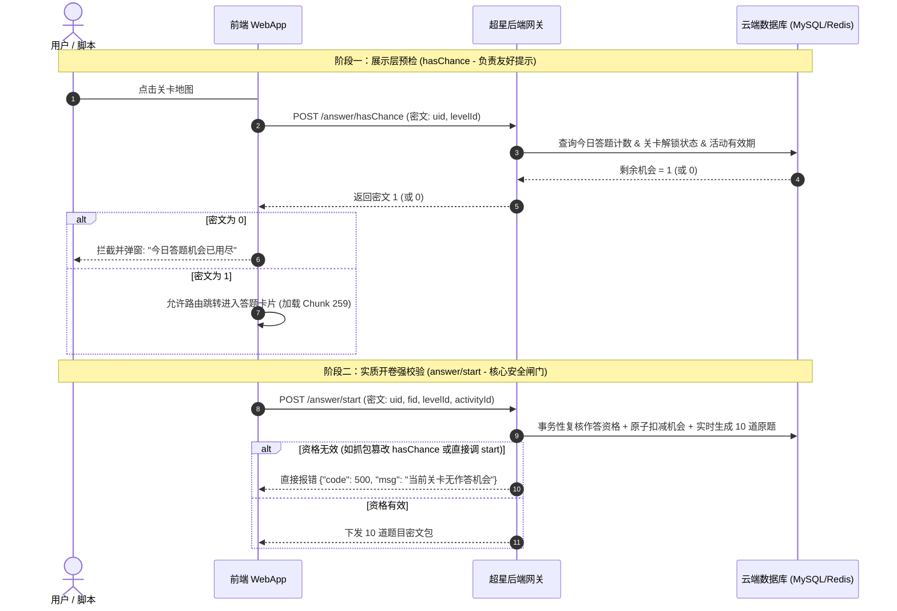
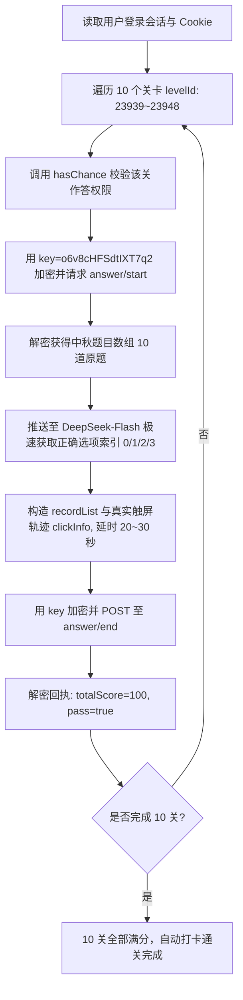

# 超星「xx闯关答题」

> **文档版本**: `v1.5.0` 
> **更新时间**: `2026-09-24`  
> **抓包来源**: `Reqable 3.2.23` 导出的 HAR 报文  
> **分析对象**: 超星移动端（学习通）闯关答题系统 (`custom-answer`)  
> **整理责任**: 

---

## 一、关联文件与本地资产路径汇总

哈基米已在 [docs/api_spec](file:///d:/cursor/java--xxt/docs/api_spec/) 目录下将抓包数据、解密出来的真实试题明文、前端全量源码、解密字典以及白名单规范归类：

| 资产文件 | 文件类型 | 本地绝对路径 | 作用与说明 |
| :--- | :--- | :--- | :--- |
| **技术规范文档** | `.md` | [chaoxing_custom_answer_api_doc.md](file:///d:/cursor/java--xxt/docs/api_spec/chaoxing_custom_answer_api_doc.md) | 本规范文档（已修正为 100% 真实报文数据，已完成全量隐私脱敏） |
| **URL 规则白名单** | `.md` | [url_whitelist.md](file:///d:/cursor/java--xxt/docs/api_spec/url_whitelist.md) | 针对 Reqable / 抓包工具与网关防火墙的通配符与域名规则白名单 |
| **真实试卷明文** | `.json` | [real_decrypted_questions.json](file:///d:/cursor/java--xxt/docs/api_spec/real_decrypted_questions.json) | **实测解密真实试卷**：从抓包密文中解出的真实中秋知识问答 10 道原题 |
| **原始 HAR 抓包** | `.har` | [chaoxing_custom_answer_capture.har](file:///d:/cursor/java--xxt/docs/api_spec/chaoxing_custom_answer_capture.har) | 从微信缓存目录转存的持久化备份 (9.4 MB) |
| **前端主程序 Bundle** | `.js` | [app.js](file:///d:/cursor/java--xxt/docs/api_spec/app.js) | 包含核心安全模块 `0x457`（加解密与反作弊中心）与 API 调度中心 (2.3 MB) |
| **底层依赖 Vendor 库** | `.js` | [chunk-vendors.js](file:///d:/cursor/java--xxt/docs/api_spec/chunk-vendors.js) | 包含 Vue 运行时、CryptoJS 加密库及 UI 依赖 (4.2 MB) |
| **原始混淆业务脚本** | `.js` | [core_answer_logic.js](file:///d:/cursor/java--xxt/docs/api_spec/core_answer_logic.js) | 闯关答题业务 Chunk 259 原始混淆代码 (297 KB) |
| **反混淆清晰业务源码** | `.js` | [core_answer_logic.deobf.js](file:///d:/cursor/java--xxt/docs/api_spec/core_answer_logic.deobf.js) | 完成字符串还原与转义解码的业务源码 |
| **全量解密字典表** | `.json` | [string_lookup_table.json](file:///d:/cursor/java--xxt/docs/api_spec/string_lookup_table.json) | 成功还原的 2,837 条混淆字符串映射表 |

---

## 二、真实加解密机制与核心密钥 (Empirical Cryptography Specification)

经哈基米在 [app.js](file:///d:/cursor/java--xxt/docs/api_spec/app.js) 模块 `0x457` 的逆向追踪与 Node.js 动态解密实测验证，超星闯关答题系统采用的真实加密参数如下：

* **核心对称加密算法**: **AES-128**
* **分组模式 (Mode)**: **ECB (Electronic Codebook)**
* **填充模式 (Padding)**: **PKCS7Padding**
* **全局硬编码密钥 (AES Key)**:
  $$\mathbf{Key = "o6v8cHFSdtIXT7q2"}$$
  *(在源码中由混淆字典拼接生成：`_0x3a030b(0x2307) + _0x3a030b(0x2554)`，长度为 16 字节 / 128 位)*

### 1. 通用加解密函数标准实现 (Node.js / Python 可复用)
```javascript
const CryptoJS = require('crypto-js');
const KEY = CryptoJS.enc.Utf8.parse("o6v8cHFSdtIXT7q2");

// 加密函数 (对应前端 packParams)
function encrypt(plaintext) {
    return CryptoJS.AES.encrypt(plaintext, KEY, {
        mode: CryptoJS.mode.ECB,
        padding: CryptoJS.pad.Pkcs7
    }).toString();
}

// 解密函数 (对应前端 wyjdecrypt)
function decrypt(ciphertext) {
    const bytes = CryptoJS.AES.decrypt(ciphertext, KEY, {
        mode: CryptoJS.mode.ECB,
        padding: CryptoJS.pad.Pkcs7
    });
    return CryptoJS.enc.Utf8.stringify(bytes).toString();
}
```

---

## 三、真实报文解密结果比对 (HAR 实测解密，已脱敏)

哈基米已使用上述密钥对用户抓包中的所有核心接口进行了真实解密，并对个人隐私数据（UID、FID、真实姓名等）完成了严格脱敏替换：

### 1. 检查作答机会 (`answer/hasChance`)
* **请求 URL**: `POST https://tvu.chaoxing.com/api/applet/activity/answer/hasChance?uid=<USER_UID>&fid=<SCHOOL_FID>&activityId=3770`
* **请求载荷解密明文**:
  ```json
  {
    "levelId": 23939,
    "uid": "<USER_UID>"
  }
  ```
* **响应数据解密明文**: `1` (表示当前关卡拥有 1 次作答机会)

---

### 2. 开始答题拉取试卷 (`answer/start`)
* **请求 URL**: `POST https://tvu.chaoxing.com/api/applet/activity/answer/start?uid=<USER_UID>&fid=<SCHOOL_FID>&activityId=3770`
* **请求载荷解密明文**:
  ```json
  {
    "levelId": 23939,
    "uid": "<USER_UID>",
    "fid": "<SCHOOL_FID>",
    "activityId": "3770"
  }
  ```
* **响应试卷密文**: 长度 2,688 字节的 Base64 密文
* **真实解密后的 10 道试题列表（中秋节主题）**:
  ```json
  [
    { "id": 257583, "questionTitle": "古时祭月摆放的主贡品为", "optionA": "糕点", "optionB": "肉食", "optionC": "酒水", "optionD": "月饼、瓜果", "type": 1 },
    { "id": 257563, "questionTitle": "中秋节固定为农历的哪一天", "optionA": "七月十五", "optionB": "八月十五", "optionC": "九月初九", "optionD": "八月初八", "type": 1 },
    { "id": 257589, "questionTitle": "中秋\"团圆\"寓意源自", "optionA": "秋季丰收", "optionB": "月亮升起", "optionC": "圆月象征阖家圆满", "optionD": "古人祭祀习惯", "type": 1 },
    { "id": 257572, "questionTitle": "神话里月宫陪伴嫦娥的小动物是", "optionA": "玉兔", "optionB": "松鼠", "optionC": "仙鹤", "optionD": "灵狐", "type": 1 },
    { "id": 257564, "questionTitle": "中秋又叫仲秋，\"仲\"代表第几个月", "optionA": "每季第2个月", "optionB": "每季第1个月", "optionC": "每季第3个月", "optionD": "八月中旬", "type": 1 },
    { "id": 257585, "questionTitle": "中秋的时候，民间常吃哪种应季水果", "optionA": "草莓", "optionB": "西瓜", "optionC": "石榴、柚子", "optionD": "芒果", "type": 1 },
    { "id": 257586, "questionTitle": "嫦娥奔月神话故事当中，嫦娥吃下的是", "optionA": "不死仙药", "optionB": "蟠桃", "optionC": "人参果", "optionD": "灵果", "type": 1 },
    { "id": 257570, "questionTitle": "古人常说\"三秋\"，其中中秋处于", "optionA": "孟秋", "optionB": "仲秋", "optionC": "季秋", "optionD": "晚秋", "type": 1 },
    { "id": 257588, "questionTitle": "广式月饼馅料常见为", "optionA": "鲜肉", "optionB": "莲蓉蛋黄", "optionC": "酥糖", "optionD": "豆沙酥", "type": 1 },
    { "id": 257578, "questionTitle": "下面哪首诗词为中秋千古名篇", "optionA": "望庐山瀑布", "optionB": "春晓", "optionC": "枫桥夜泊", "optionD": "水调歌头·明月几时有", "type": 1 }
  ]
  ```

> [!WARNING]
> **关于 `rightOption` 的重要事实修正**:
> 经实测解密验证，**后端在此次活动中并未在试题接口中下发 `rightOption`（正确答案）字段**！
> 前端 JS 源码中虽然包含 `_0x4db790.rightOption` 代码分支，但那是受 `if (this.showAnswer)` 控制的仅在开启解析时生效的兼容分支。在正常闯关流程中，题目数据只包含题干与选项，**因此全自动答题必须接入 AI（如项目中的 DeepSeek 嗅探助手）或本地题库进行题目匹配与解答**。

---

### 3. 作答提交与成绩结算 (`answer/end`)
* **请求提交明文解密 (用户答题记录与遥测埋点)**:
  ```json
  {
    "recordList": [
      { "questionId": 257583, "userOption": "0" },
      { "questionId": 257563, "userOption": "1" },
      { "questionId": 257589, "userOption": "1" },
      { "questionId": 257572, "userOption": "0" },
      { "questionId": 257564, "userOption": "3" },
      { "questionId": 257585, "userOption": "2" },
      { "questionId": 257586, "userOption": "0" },
      { "questionId": 257570, "userOption": "1" },
      { "questionId": 257588, "userOption": "1" },
      { "questionId": 257578, "userOption": "3" }
    ],
    "levelId": 23939,
    "fid": "<SCHOOL_FID>",
    "uid": "<USER_UID>",
    "clickInfo": {
      "pageX": [256, 264, 263, 253, 249, 252, 263, 256, 259, 248],
      "pageY": [287, 368, 333, 323, 459, 412, 317, 369, 328, 467],
      "timeStamp": [[1010870], [1014655], [1018066], [1023015], [1027012], [1031365], [1034362], [1039113], [1044067], [1048276]],
      "isTrusted": [true, true, true, true, true, true, true, true, true, true]
    }
  }
  ```
  *(选项映射规则：`"0"`=A, `"1"`=B, `"2"`=C, `"3"`=D)*
* **服务端结算响应明文解密**:
  ```json
  {
    "pass": true,
    "timeConsume": 45634,
    "totalScore": 70
  }
  ```
  *(实测记录对应：用户答对 7 题，得分 70 分，耗时 45.6 秒，满足及格线 70 分，通关成功！)*

---

### 3.4 遥测与反作弊埋点深度剖析 (`clickInfo`)

前端源码 `core_answer_logic.js` 中 `clickAnswer` 与 `wyjsaveuserscore` 方法揭示了该活动的前端行为风控体系：

```javascript
// 用户点击选项时的遥测采集 (clickAnswer)
clickAnswer(item, index, event) {
  this.pageXs.push(event.pageX);
  this.pageYs.push(event.pageY);
  this.isTrusteds.push(event.isTrusted);
  this.timestampsItem.push(event.timeStamp);
  ...
}

// 提交结算时的组包逻辑 (wyjsaveuserscore)
var clickInfo = {
  "pageX": this.pageXs,
  "pageY": this.pageYs,
  "timeStamp": this.timestamps,  // 二维数组，按题目分组记录点击时间
  "isTrusted": this.isTrusteds   // 原生 DOM 事件信任标识数组
};
```

#### 遥测字段核心作用表
| 字段名 | 数据类型 | 来源与格式 | 风控检测维度与判罚依据 |
| :--- | :--- | :--- | :--- |
| **`pageX`** | `number[]` | 触控点相对 Document 的 X 坐标 (px) | **物理碰撞盒检测**：必须落在对应题目选项的 DOM 范围内；**离散度与方差分析**：真人点击存在高斯分布抖动，若全部点在绝对相同坐标（方差为 0）则判定为死板脚本。 |
| **`pageY`** | `number[]` | 触控点相对 Document 的 Y 坐标 (px) | 同上。结合题目在页面中的垂直排版，第 1 题至第 10 题随着答题翻页或滚动，Y 坐标应符合移动端屏幕视口布局特征。 |
| **`timeStamp`** | `number[][]` | DOM 高精度时间戳矩阵 (ms) | **阅读与答题时延分析**：每道题点击的时间差必须大于人类神经生理反应与阅读理解的下限（通常 > 1.5~2.5 秒/题），秒答或时间倒流会被直接标记。 |
| **`isTrusted`** | `boolean[]` | 浏览器 `Event.isTrusted` 原生属性 | **脚本合成事件初筛**：真人物理触摸为 `true`，通过 `element.click()` 派发为 `false`。若存在 `false` 则属于“自爆”脚本作弊，触发一票否决。 |

---

### 3.5 关卡资格校验与云端权限控制闭环 (`hasChance` 深度分析)

针对活动中的答题资格检查，架构上实行**“完全由云端权威控制（Server-Authoritative）”**的强闭环机制，前端仅为展示层初筛：



#### 关键安全特征：
1. **无本地客户端签名票据**：`hasChance` 仅返回数字 `1`，无 Token/Ticket，因此无法用于欺骗后续环节。
2. **`answer/start` 原子事务强校验**：真正下发题目的 `start` 接口独立在云端扣减次数，彻底杜绝单靠绕过前端页面实现无限答题的可能。

---

## 四、全自动通关脚本架构设计 (AI 驱动版)

由于实测证实试卷不带答案，最稳健高效的通关脚本架构与本项目现有的 `live_ai_sniffer.py` 完全契合：


